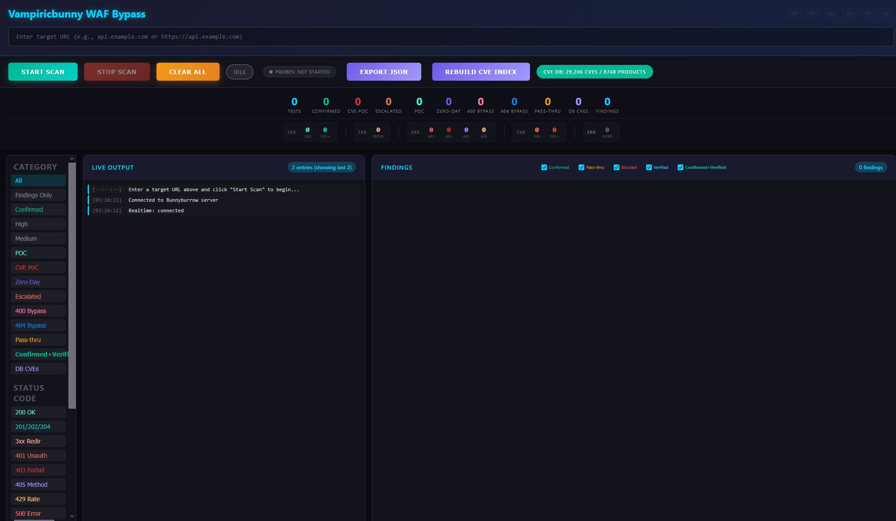
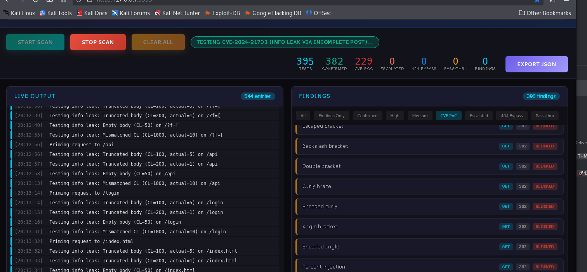
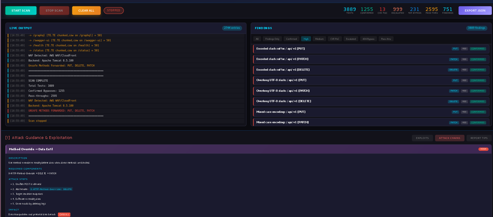
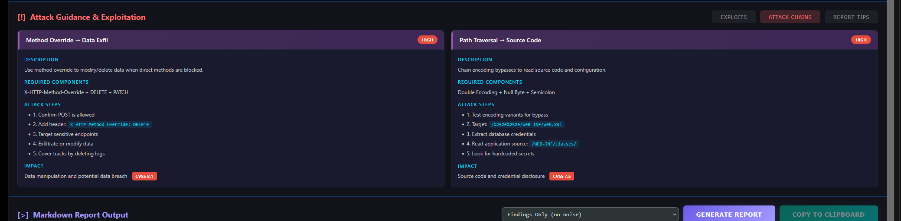
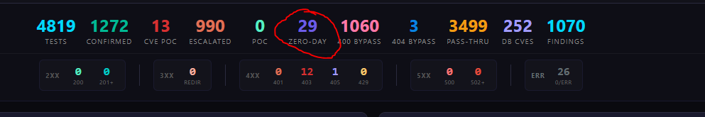

# BunnyBurrow

# WAF Bypass Mapper - Defensive Security Assessment Platform

## What This Is

A full-stack, real-time web application firewall (WAF) bypass mapping and impact validation tool built for authorized blue team defensive security assessment. Designed from the ground up around the Bugcrowd Vulnerability Rating Taxonomy (VRT) methodology, this tool automates the discovery, validation, and severity classification of WAF bypass vulnerabilities - the same workflow a senior penetration tester performs manually over hours, compressed into a single automated scan.

The tool does not just find WAF bypasses. It proves whether they matter.

---

## The Problem It Solves

Most WAF bypass tools stop at "I got a different HTTP response." They flag a bypass and assign a high severity. In reality, a WAF bypass without demonstrated impact is informational noise - Bugcrowd triagers consistently reject bypass-only submissions as P5 (Informational). The gap between "WAF was bypassed" and "this bypass enables real exploitation" requires secondary validation that typically demands manual effort from an experienced tester.

This tool bridges that gap automatically. Every confirmed bypass triggers a deep secondary probe pipeline that attempts to prove real-world impact: local file inclusion, server-side template injection, remote code execution, admin panel access, credential exposure, request smuggling desync, and more. Only findings with proven impact escalate above P5.

---

## Architecture Overview

The platform is a Python-based web application using Flask for HTTP routing, Flask-SocketIO for bidirectional WebSocket communication, and Eventlet for non-blocking concurrent I/O. The frontend is a single-page application rendered in the browser, communicating with the backend over both REST API calls and persistent WebSocket connections.

When a scan starts, the backend spawns a background thread that executes a multi-phase testing engine. Every finding, log message, and status update is pushed to connected browsers in real time over WebSocket. The browser renders findings live with dynamic severity badges, expandable detail cards, and one-click reproducible curl commands.

The system is fully self-contained - no external APIs, no cloud dependencies. It runs on Windows, Linux/Kali, or Docker with a single command.

---

## Six-Phase Automated Testing Pipeline

### Phase 1 - Core Bypass Technique Suites

Twelve distinct categories of WAF bypass techniques, totaling over 300 individual test payloads:

- **HTTP Method Abuse** - 23 HTTP methods including WebDAV verbs (PROPFIND, MKCOL, COPY, MOVE, LOCK/UNLOCK) and debug methods (TRACE, DEBUG, TRACK, PURGE)
- **Path Encoding Bypasses** - 60+ URL encoding variants including double encoding, overlong UTF-8 sequences, UTF-16 fullwidth characters, semicolon injection, null byte injection, HTML entity encoding, and Unicode normalization attacks
- **Header Injection** - 60+ header manipulation tests spanning IP spoofing (21 X-Forwarded-For variants including IPv6, integer representation, and RFC 7239 Forwarded), host manipulation, URL override headers, protocol downgrade, CloudFlare-specific headers, and content-type tricks
- **HTTP Method Override** - 17 override techniques using X-HTTP-Method-Override, X-Method-Override, X-HTTP-Method, and body-based _method parameters
- **User-Agent Spoofing** - 25+ user agent strings covering search engine crawlers, social media bots, internal scanners, mobile devices, and injection payloads embedded in the UA string
- **Request Smuggling Indicators** - Transfer-Encoding and Content-Length manipulation variants to detect HTTP request desync potential
- **Protocol-Level Attacks** - Via header manipulation, connection upgrade attempts (WebSocket, h2c), and cache control abuse
- **Case Manipulation** - URL case variation, Turkish I encoding, Kelvin sign Unicode normalization, and 28 mixed-case HTTP method variants
- **Content-Type Bypass** - 13 content type variations including charset tricks (UTF-7), multipart boundaries, and malformed types
- **WAF-Specific Tests** - Targeted tests for CloudFlare and AWS WAF/CloudFront using cloud-specific header formats
- **HTTP Parameter Pollution** - 20+ parameter manipulation tests including duplicate parameters, array syntax, long values, and injection through parameter names
- **XSS Reflection Detection** - Marker-based reflection testing across 9 injection vectors (query, path, headers, cookies, POST body) to identify unescaped output

### Phase 2 - Targeted CVE Exploitation

high-impact CVE tests executed inline:
| Module | Coverage |
-CVE-2024-50379- Apache Tomcat TOCTOU race condition with case-variant JSP upload attempts across 6 filename variations
CVE-2024-52316- Jakarta Authentication (JASPIC) bypass using 12 authentication bypass techniques against 12 protected endpoint paths
CVE-2023-46589 - HTTP request smuggling via malformed trailer headers with 12 Transfer-Encoding/Content-Length desync variants, including chaining with any previously confirmed bypass headers
-CVE-2024-21733 - Apache Tomcat information leak via truncated POST body technique
| Nginx | CVE-2017-7529 (range filter info leak), CVE-2019-20372 (request smuggling), CVE-2021-23017 (DNS resolver overflow), CVE-2021-3618 (ALPACA cross-protocol), plus misconfiguration tests |
| Apache HTTPD | CVE-2021-41773 and CVE-2021-42013 (path traversal/RCE), CVE-2024-38476, CVE-2024-39884, CVE-2023-25690 (request splitting) |
| Microsoft IIS | CVE-2017-7269 (WebDAV buffer overflow), CVE-2021-31166 (HTTP.sys), short filename 8.3 enumeration, source code disclosure, verb tampering |
| Spring Boot | CVE-2022-22965 (Spring4Shell), CVE-2022-22963 (SpEL injection), CVE-2024-22243 (URL parsing), Spring Actuator endpoint exposure |
| Node.js/Express | Prototype pollution via constructor and **proto** injection, CVE-2024-22019 (HTTP splitting), path traversal, debug endpoint exposure |
| PHP | CVE-2024-4577 (argument injection via charset), CVE-2012-1823 (query-string code execution), type juggling bypass, phpinfo disclosure |
| WordPress | XML-RPC brute force detection, REST API user enumeration, debug log exposure, CVE-2024-6386 |

### Phase 3 - Deep 404/400 Bypass and Method Escalation

28 encoding tricks applied against 35 real endpoint paths to find accessible resources behind error pages. Confirmed bypass headers are then replayed against discovered endpoints with escalated HTTP methods (POST, PUT, PATCH, DELETE) to test for write access.

### Phase 4 - CVE Database Correlation

Automatic lookup of all detected backend technologies against a local database of 331,000+ CVEs spanning 1999-2026 (sourced from the CVEProject/cvelistV5 dataset). Results are filtered to web-relevant technologies (60+ product keywords), ranked by CVSS score, and the top 10 most critical CVEs per backend are surfaced in the live log stream.

The CVE database is fully local - no external API calls. It supports version-range filtering, free-text search, and CVSS v2/v3/v4 scoring.

### Phase 5 - Zero-Day Discovery Module

Ten independent vulnerability class test suites probing for previously unknown issues:

- Server-Side Template Injection (SSTI) across 6 template engine syntaxes
- SQL Injection (error-based and time-based blind)
- NoSQL Injection (MongoDB operator syntax)
- OS Command Injection (24 shell metacharacter variants)
- Server-Side Request Forgery (SSRF) against 11 targets including cloud metadata endpoints
- XML External Entity (XXE) injection
- Advanced Path Traversal with encoding chains
- CRLF Header Injection
- Insecure Deserialization across Java, PHP, .NET, and Python serialization formats
- Parameter Fuzzing for edge-case input handling

### Phase 6 - Escalation Engine (Optional, Consent-Gated)

Active exploitation module requiring explicit user opt-in. Tests LFI, SSTI, SQLi, SSRF, XXE, and RCE through confirmed bypass paths. All payloads use non-destructive read-only commands (id, whoami, echo) - never write or modify operations.

---

## Deep Probe System - Impact Validation Engine

The deep probe is the core differentiator. When a bypass is confirmed, the tool automatically runs 130-160 secondary probes through the bypass path to prove whether it enables real exploitation.

### Probe Categories

**Technique-Specific Probes** - Tailored to the bypass type. Path traversal bypasses get LFI probes targeting sensitive files. SSTI-related bypasses get template expression evaluation tests. Command injection variants get OS command probes. SSRF-related bypasses get internal network pivot probes.

**Baseline Verification** - GET, HEAD, and OPTIONS requests through the bypass path to establish what "normal" looks like through the bypass.

**Escalation Path Probes** - Approximately 80 high-value endpoint paths organized in six impact tiers:

- Tier 1: Admin and management consoles (admin, console, dashboard, manager, jmx-console)
- Tier 2: Internal APIs and documentation (api/internal, graphql, swagger, openapi)
- Tier 3: Debug and monitoring endpoints (Spring Actuator suite, server-status, phpinfo, Prometheus, Grafana)
- Tier 4: Sensitive configuration files (.env, .git/config, web.config, wp-config.php, .htpasswd)
- Tier 5: Infrastructure management (Jenkins, Kubernetes secrets API, Docker socket)
- Tier 6: Database and log files (phpMyAdmin, backup.sql, error.log, WEB-INF/web.xml)

**IP Spoofing Header Probes** - 15 header variants (X-Forwarded-For, True-Client-IP, Cluster-Client-IP) with internal IP addresses targeting admin paths.

**Cloud-Specific Header Probes** - CloudFlare and AWS CloudFront header manipulation targeting administrative endpoints.

**URL Override Probes** - X-Original-URL and X-Rewrite-URL headers redirecting backend routing to sensitive paths.

**Authentication Bypass Probes** - Basic auth with common credentials, null Bearer tokens, forged JWT admin claims, and debug/bypass cookies.

**User-Agent Spoofing Probes** - Googlebot, Bingbot, and Internal Scanner strings targeting admin paths that may have crawler exceptions.

### What It Detects

Every probe response is analyzed for specific impact indicators:

- **LFI Confirmed** - File content patterns (passwd entries, web.xml servlet declarations, .env variables)
- **RCE Confirmed** - Command output patterns (uid/gid from id command, echo reflection)
- **SSTI Possible** - Mathematical evaluation results (49 from 7*7 expressions) without literal reflection
- **Info Disclosure** - Credential and secret patterns (database passwords, API keys, AWS access keys)
- **Access Bypass** - HTTP 200 responses on admin/management/console paths
- **Auth Redirect** - 301/302 redirects to login pages confirming endpoint existence behind authentication
- **Escalation Confirmed** - Substantial response bodies (200+ bytes) with non-error content on sensitive paths
- **Methods Exposed** - Allow headers listing dangerous HTTP methods

---

## Severity Classification - Bugcrowd VRT Alignment

The P-value system implements a strict impact-first methodology directly informed by Bugcrowd triager feedback.

**The Core Rule: WAF bypass alone is always P5 (Informational). Impact must be proven to escalate.**

| Severity | Label | Required Evidence |
|---|---|---|
| P1 | Critical | Proven RCE output, confirmed LFI file content, SQL error with database output, XXE or deserialization with deep probe evidence, exposed secrets validated by deep probe |
| P2 | Severe | Deep probe confirmed admin panel access (200 OK on management paths), confirmed SSRF internal pivot, accepted write methods (PUT/DELETE/PATCH) with 2xx response, confirmed SSTI evaluation, confirmed path traversal with file read, CVE or zero-day with deep probe evidence |
| P3 | Moderate | Confirmed information disclosure from escalation probes, confirmed CRLF injection (injected header present in response), reflected XSS with unescaped marker, SSRF with host override returning 200 plus deep probe validation, request smuggling with deep probe evidence of exploitable desync |
| P4 | Low | Deep probe found some evidence but no escalation or information disclosure - indicates metadata or technology stack exposure only |
| P5 | Informational | Default for all bypasses. Bypass without proven impact. Passthrough responses. No deep probe run yet. Smuggling indicators without evidence of exploitable desync |
| P0 | Blocked | WAF blocked the request entirely - no bypass achieved |

### Confirmatory Probe Architecture

Before any finding is broadcast to the UI, the server runs the ImpactAssessor module which evaluates three critical security questions:

1. Is the connection reaching a different trust zone? (response differs from baseline, backend-specific headers present)
2. Can this access something that was previously blocked? (baseline returned 403/401, bypass returns 2xx with content)
3. Can this carry a secondary request? (technique involves smuggling or desync indicators)

Six confirmatory follow-up probes (four header variants plus two method overrides) are executed for every potential bypass. The final severity is computed from the worst-case outcome across all probes. This architecture reduces false positives at the finding level rather than relying on post-hoc filtering.

---

## Real-Time User Interface

### Live Scanning Dashboard

- **Log Stream Panel** - Color-coded real-time log messages (info, warning, error) streamed over WebSocket as each test executes
- **Findings Panel** - Expandable finding cards appearing live as bypasses are confirmed, each displaying technique name, HTTP method, status code, confidence level, and a dynamic P-value badge
- **Statistics Bar** - Running counters for total tests executed, confirmed bypasses, proof-of-concept hits, and 400-bypass anomalies
- **Status Indicator** - Current phase and test suite being executed

### Filtering and Classification

- **P-Value Filter Tabs** - Filter findings by severity level (P1 through P5, Blocked)
- **Confidence Toggles** - Show/hide confirmed bypasses, pass-throughs, and blocked results independently
- **Confirmed+Verified Mode** - Default active filter showing only the highest-confidence findings: those that are both confirmed (WAF bypassed) and verified (backend contact proven). Explicitly excludes all P5 and P0 findings
- **Verified Toggle** - Restrict display to findings with proven backend contact

### Per-Finding Actions

- **Expandable Detail Cards** - Full HTTP response headers, body snippet (500 characters), response timing, confidence classification, and complete P-value reasoning explanation
- **Copy AI Prompt** - One-click generation of a context-rich prompt for AI assistants, including target URL, technique used, finding category, and specific exploitation guidance requests
- **Deep Probe Button** - On-demand secondary testing for any individual finding, with results updating the finding's P-value badge in real-time
- **Reproducible Curl Commands** - Every finding and every deep probe result includes a ready-to-paste curl command for manual verification

### Reporting

- **Markdown Report Generator** - Structured report with executive summary, WAF/backend detection results, findings table, and per-finding sections with reproducible commands
- **JSON Export** - Machine-readable export of all findings with complete response data
- **Persistent Storage** - Scan results automatically saved as timestamped JSON files for historical reference

---

## WAF and Backend Detection

### WAF Detection

Automatically identifies CloudFlare (CF-Ray, CF-Cache-Status, __cfduid cookie) and AWS WAF/CloudFront (X-Amz-Cf headers, awselb cookie) from response headers and adjusts testing strategy with WAF-specific bypass modules.

### Backend Technology Detection

Identifies 10+ backend technologies from response fingerprints: Nginx, Apache HTTPD, Apache Tomcat, Microsoft IIS, Spring Boot, Node.js/Express, PHP, WordPress, Django, Flask/Gunicorn, and Ruby on Rails. Detection triggers automatic loading of the corresponding backend-specific CVE exploit module.

---

## Security and Operational Design

### Non-Destructive by Default

- All verification uses read-only HTTP methods (HEAD, OPTIONS, GET)
- Escalation probes use non-destructive commands only (id, whoami, echo)
- Active exploitation (XSS injection, write methods) requires explicit opt-in flags
- The escalation engine (Phase 7) is gated behind a consent toggle in the UI
- Rate-limited probing (500ms between requests) to avoid service disruption

### Professional Bug Bounty Alignment

- Severity classifications reference specific Bugcrowd triager feedback
- P-value reasoning explains each classification in language that maps directly to Bugcrowd VRT categories
- Findings include the exact information needed for a professional vulnerability report submission
- The tool distinguishes between bypass indicators and confirmed exploitation - the same distinction that determines whether a bug bounty submission is accepted or rejected

### Self-Contained Deployment

- No external API dependencies - all testing and CVE correlation runs locally
- Cross-platform: native Windows, native Linux/Kali, or Docker
- Single-command startup with automatic dependency installation
- Scan results persist to disk as timestamped JSON for engagement documentation

---

## Technical Scale

| Metric | Value |
|---|---|
| Core bypass technique payloads | 300+ |
| Named CVE exploit tests | 25+ across 7 backend modules |
| Deep probe paths per finding | 130-160 |
| Local CVE database entries | 331,000+ (1999-2026) |
| Web technology detection keywords | 60+ |
| Zero-day vulnerability class tests | 10 independent suites |
| Endpoint discovery paths | 50+ |
| IP spoofing header variants | 21+ |
| HTTP methods tested | 23 |
| User agent strings | 25+ |
| URL encoding variants | 60+ |
| Header injection tests | 60+ |
| Escalation path tiers | 6 (approximately 80 paths) |

---

## Skills Demonstrated

- Full-stack web application development (Python backend, JavaScript frontend, WebSocket real-time communication)
- Deep understanding of HTTP protocol mechanics (methods, headers, encoding, smuggling, chunked transfer)
- WAF evasion methodology and defensive assessment technique design
- Vulnerability classification aligned with industry-standard taxonomies (Bugcrowd VRT, CVSS, CWE)
- CVE research and exploit development across multiple backend technology stacks
- Automated impact validation pipeline design - moving beyond detection to proof of exploitability
- Security-conscious development practices (consent gates, non-destructive defaults, rate limiting)
- Real-time data streaming architecture (WebSocket event system with late-join state replay)
- Large-scale data integration (331K+ CVE records with product correlation and version-range filtering)
